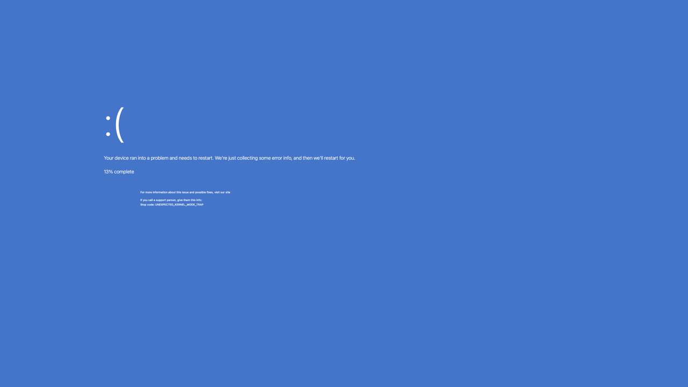
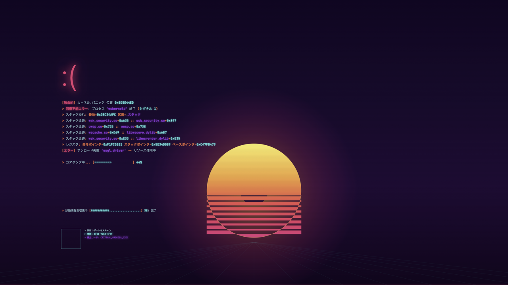

# Blue Screen of Death

**A modern bell of awareness: protect eyesight and attention.**

Blue Screen of Death is a macOS menu bar app that gently reminds you to take screen breaks by displaying a full-screen retro-inspired blue screen at regular intervals. Press any key to dismiss and return to work refreshed.

Inspired by the 20-20-20 rule recommended by eye care professionals — every 20 minutes, look at something 20 feet away for 20 seconds — Blue Screen of Death turns a moment of classic computing nostalgia into a tool for digital wellbeing.

## Features

- **Timed reminders** — configurable intervals (30 min, 1 hr, 2 hr, 4 hr)
- **Custom schedule** — choose active days and hours (e.g., weekdays 9 AM–5 PM)
- **Retro aesthetic** — procedurally generated hex dumps and memory addresses for an authentic nostalgic experience
- **Instant dismiss** — press any key to clear the screen and get back to work
- **Menu bar only** — lives quietly in your menu bar as `0x`, no dock icon clutter
- **Zero data collection** — no network access, no analytics, no tracking
- **No permissions required** — runs entirely in user space

## Screenshots

### Windows Modern (English)



### CyberWin 2070 (Japanese)



## Building

Requires macOS 13+ and Xcode Command Line Tools (Swift 5.9+).

```bash
# Build the app
make build

# Build and create the .app bundle
make bundle

# Build and run the app
make run

# Run directly (faster iteration, dock icon may appear)
make run-debug

# Run tests
make test

# Run linter (requires swiftlint: brew install swiftlint)
make lint

# Clean build artifacts
make clean
```

## Manual Testing

1. **Build and launch:** `make run`
2. **Verify menu bar:** Look for `0x` in the macOS menu bar
3. **Trigger manually:** Click `0x` → select "Trigger Now" (or press Cmd+Shift+B)
4. **Dismiss:** Press any key while the blue screen is showing
5. **Change interval:** Click `0x` → Interval submenu → select a different interval
6. **Toggle on/off:** Click `0x` → toggle "Enabled"
7. **Custom schedule:** Click `0x` → "Custom Schedule..." → enable and configure days/hours
8. **About dialog:** Click `0x` → "About Blue Screen of Death"
9. **Quit:** Click `0x` → "Quit" (or press Cmd+Q)

## Project Structure

```
Sources/BlueScreenOfDeath/
├── BlueScreenOfDeathApp.swift   # App entry point, menu bar setup
├── AppDelegate.swift            # App lifecycle, scheduler wiring
├── MenuBarView.swift            # Menu bar dropdown UI
├── Preferences.swift            # User preferences (UserDefaults)
├── ScheduleManager.swift        # Timer-based trigger scheduling
├── CustomScheduleView.swift     # Day/hour schedule configuration UI
├── AboutView.swift              # About dialog
├── Info.plist                   # App bundle metadata
└── BlueScreenOfDeath.entitlements # App Sandbox entitlements
Tests/BlueScreenOfDeathTests/
└── BlueScreenOfDeathTests.swift # Unit tests
Makefile                         # Build, test, run, lint commands
Package.swift                    # Swift Package Manager config
```

## Privacy

Blue Screen of Death collects zero data. It requires no special permissions, makes no network requests, and stores preferences only in local UserDefaults on your Mac. What happens on your screen stays on your screen.

## App Store

- **Category:** Health & Fitness
- **Age Rating:** 4+
- **Privacy:** No data collected

## License

Copyright 2024. All rights reserved.
